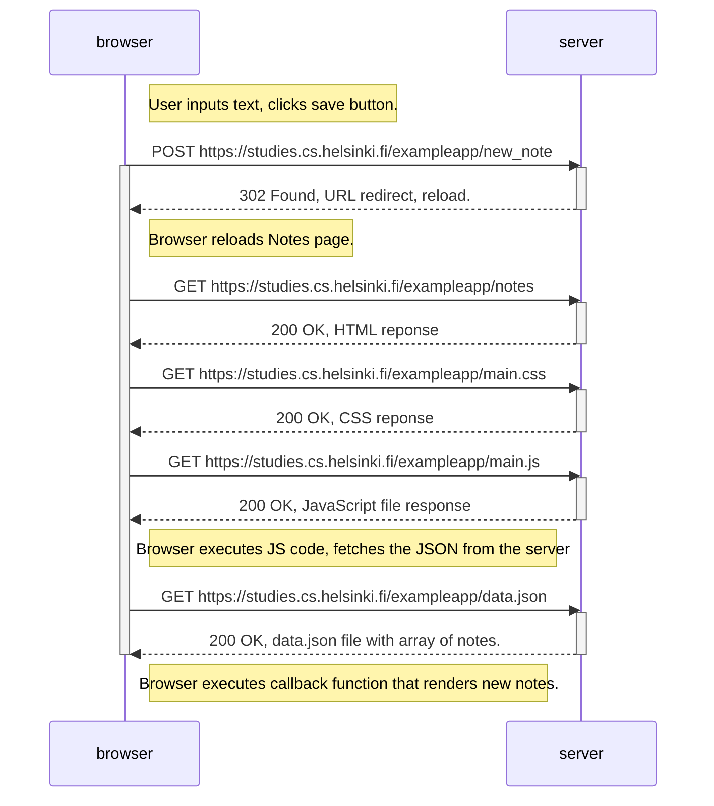

Diagram depicting situation where user creates a new note on the [page](https://studies.cs.helsinki.fi/exampleapp/notes) by writing into text field and clicking Save button.

```mermaid
sequenceDiagram
    participant browser
    participant server
    
    Note right of browser: User inputs text, clicks save button.

    browser->>server: POST https://studies.cs.helsinki.fi/exampleapp/new_note
    activate browser
    activate server
    server-->>browser: 302 Found, URL redirect, reload.
    deactivate server

    Note right of browser: Browser reloads Notes page.

    browser->>server: GET https://studies.cs.helsinki.fi/exampleapp/notes
    activate server
    server-->>browser: 200 OK, HTML reponse
    deactivate server

    browser->>server: GET https://studies.cs.helsinki.fi/exampleapp/main.css
    activate server
    server-->>browser: 200 OK, CSS reponse
    deactivate server

    browser->>server: GET https://studies.cs.helsinki.fi/exampleapp/main.js
    activate server
    server-->>browser: 200 OK, JavaScript file response
    deactivate server

    Note right of browser: Browser executes JS code, fetches the JSON from the server

    browser->>server: GET https://studies.cs.helsinki.fi/exampleapp/data.json
    activate server
    server-->>browser: 200 OK, data.json file with array of notes.
    deactivate server

    deactivate browser

    Note right of browser: Browser executes callback function that renders new notes.
```