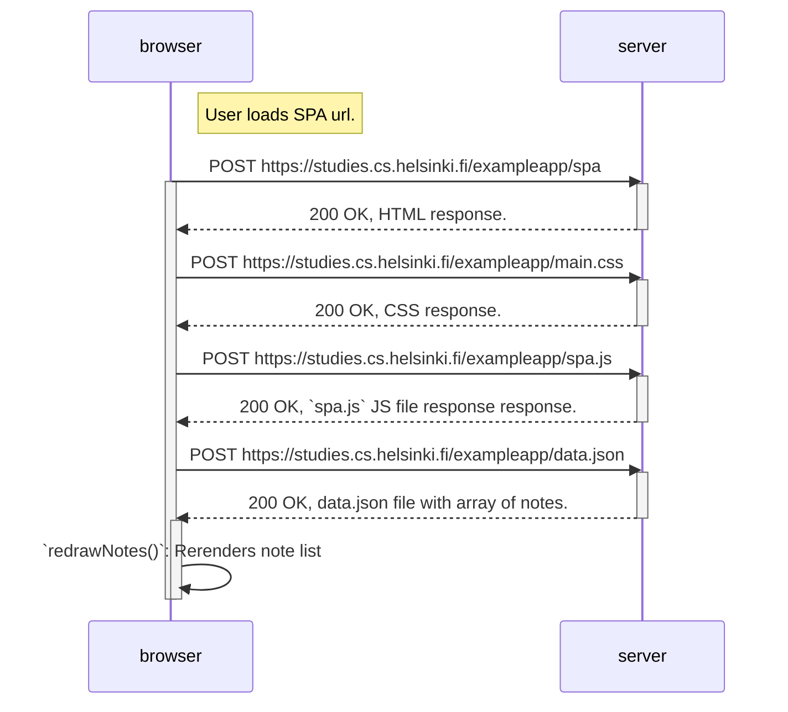

Diagram depicting situation where user goes to SPA version of the notes app at [page](https://studies.cs.helsinki.fi/exampleapp/spa).

```mermaid
sequenceDiagram
    participant browser
    participant server
    
    Note right of browser: User loads SPA url.

    browser->>server: POST https://studies.cs.helsinki.fi/exampleapp/spa
        activate browser
    activate server
    server-->>browser: 200 OK, HTML response.
    deactivate server

    browser->>server: POST https://studies.cs.helsinki.fi/exampleapp/main.css
    activate server
    server-->>browser: 200 OK, CSS response.
    deactivate server

    browser->>server: POST https://studies.cs.helsinki.fi/exampleapp/spa.js
    activate server
    server-->>browser: 200 OK, `spa.js` JS file response response.
    deactivate server


    browser->>server: POST https://studies.cs.helsinki.fi/exampleapp/data.json
    activate server
    server-->>browser: 200 OK, data.json file with array of notes.
    deactivate server

    activate browser
    browser->>browser: `redrawNotes()`: Rerenders note list
    deactivate browser

    deactivate browser

```

