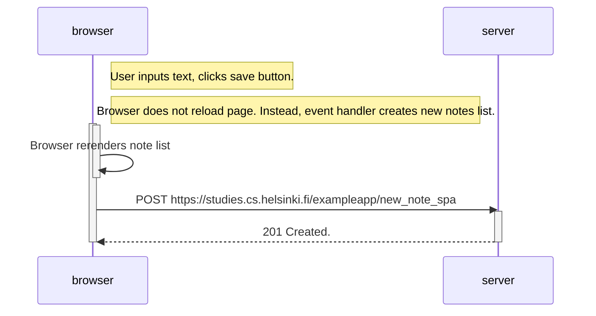

Diagram depicting situation where user creates a new note using the single-page version of the app here: [page](https://studies.cs.helsinki.fi/exampleapp/spa).

```mermaid
sequenceDiagram
    participant browser
    participant server
    
    Note right of browser: User inputs text, clicks save button.

    Note right of browser: Browser does not reload page. Instead, event handler creates new notes list.

    activate browser

    activate browser
    browser->>browser: Browser rerenders note list
    deactivate browser

    browser->>server: POST https://studies.cs.helsinki.fi/exampleapp/new_note_spa

    activate server
    server-->>browser: 201 Created.
    deactivate server
    deactivate browser


```