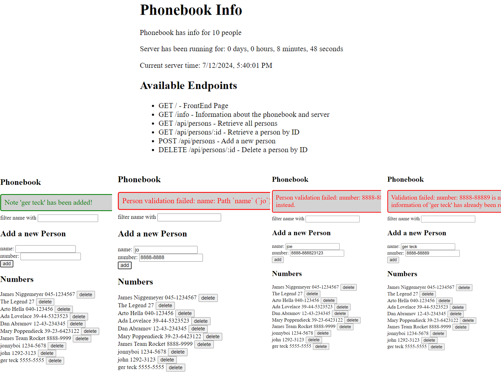

## Part 3 Submissions

### Exercises 3.1-3.22
* Ex 3.1 - 3.8 (Phonebook backend w. variables & localhost, error handling, morgan logging middleware)
* Ex 3.9 - 3.11 (frontend production build with backend, deployment online (Render))
* Ex 3.12 - 3.18 (MongoDB database, integrate to backend for CRUD, error handler middleware, update routes)
* Ex3.19 - 3.22 (Validation of input to DB, deployment, Linting code)

# Phonebook Backend (+ Frontend Build)
Node application. Powered by Nodejs, Express.

Separate Part 3 backend source code repo: [https://github.com/gerteck/full-stack-open-part3](https://github.com/gerteck/full-stack-open-part3)

Online Deployment Application Link: [https://full-stack-open-part3-phonebook.onrender.com](https://full-stack-open-part3-phonebook.onrender.com)

* Go to `{url}/info` to get some server details.
*Note*: Auto-deploy on Render turned off to update README.

